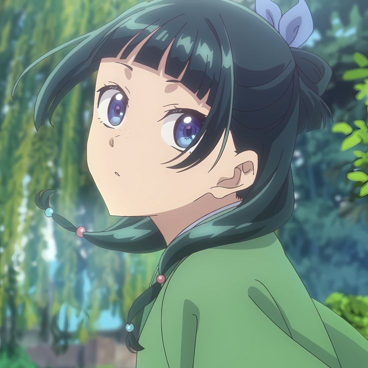
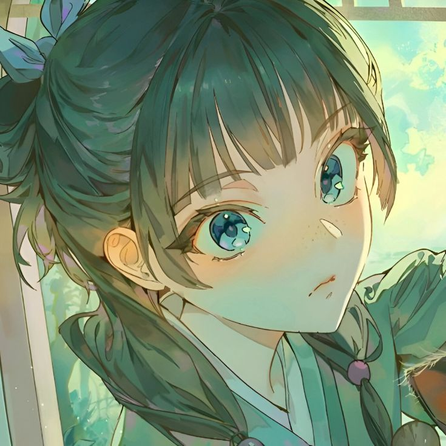

<h2 align="center">Hey! </h2>

I'm a Software Engineer from Russia, currently working in Java and C++. I primarily do backend development. I don't have
anything special, but I hope to be able to change that in the future.

My hobbies include watching Anime, Gaming, fuck ars1ks, Music and late night walks!

<h2 align="center"> 👁️‍🗨️ About me 👁️‍🗨️ </h2>

```sh
l1te@arch: ~/my_readme (main⚡)$ neofetch
```



```csharp
My Profile
-------------------------------
OS: ArchLinux
Host: lambda.fun (My project)
Username: Litenko
WhoamI: Not normal People.
Languages: Java & C++
FavouriteAnime: Sakura-sou no Pet na Kanojo.
Waifu: 綾波レイ (Rei Ayanami)
Location: Russia, Omsk.
FavouriteSong: Ты любишь танцевать - CUPSIZE.
Hobbies: Watching Anime, Gaming and Listening Music
```


<div>
<h2 align="center"> 🔎Knowledge📖 </h2>
</div>
<div align = "center">
<p align = "justify">Interests and Passions. <br></p>
<p align = "center">
     <a href="https://skillicons.dev/icons?i=js,laravel,ts">
         
    </a>
</p>
</div>
<br>

<br>
<br>

## **📫 Contact**

<a href="https://github.com/DikaArdnt"></a> **Please Contact me on Discord for a quick
response:** [L1te](https://discord.com/users/698065378219262022)


[](https://discord.com/users/698065378219262022)
[](https://t.me/anil1te)

<br>

<br>
<br>
<div align="center">
    <p>
        
    </p>
</div>
